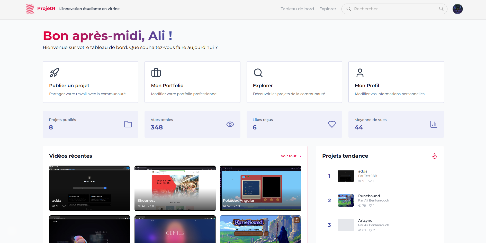
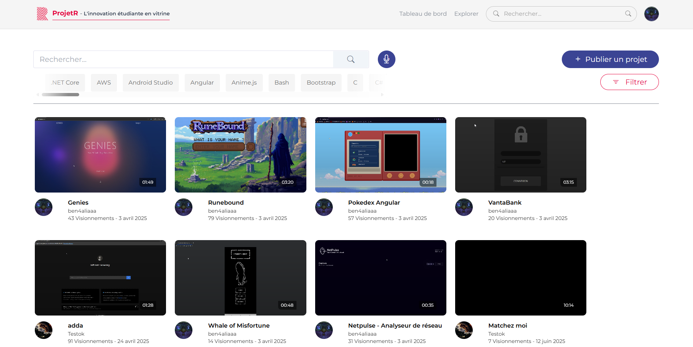
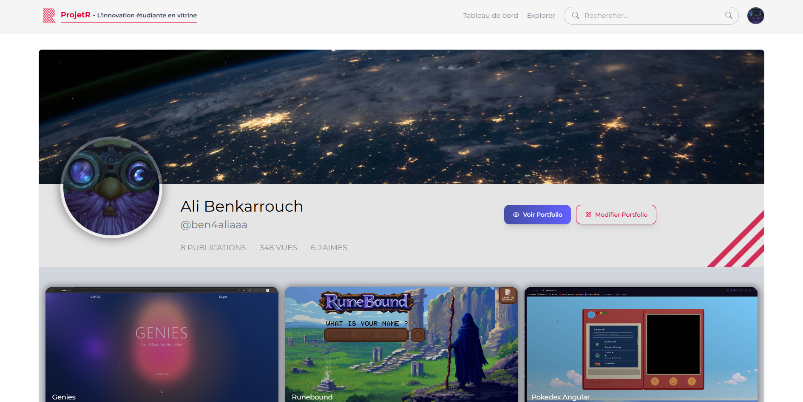
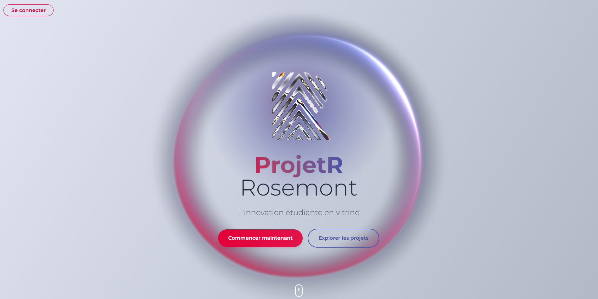
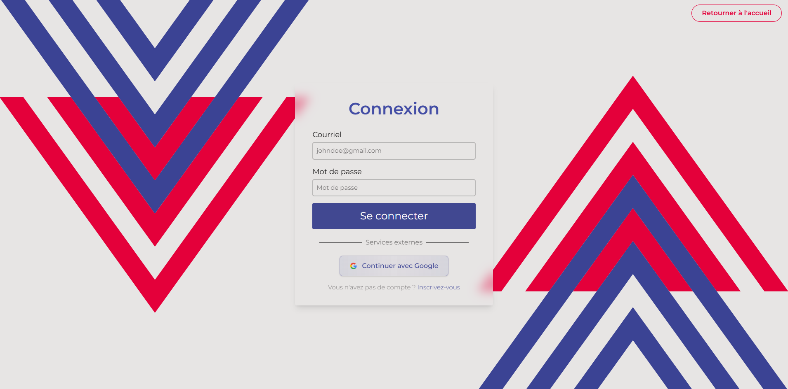
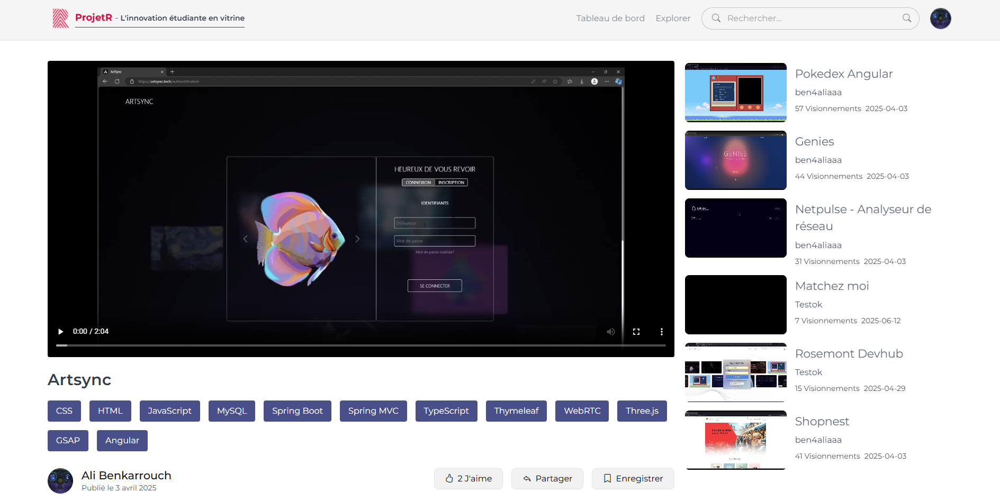

# Guide de configuration de l'authentification Google avec Firebase

## Qu'est-ce que ce projet ?

Ceci est le projet client (frontend) de la plateforme web nommée ProjetR, conçue pour faciliter la gestion de portfolios, de projets, de cours et de ressources pour les étudiants et développeurs du Cégep de Rosemont. Il propose une authentification sécurisée via Google (Firebase), une interface moderne, et une intégration complète avec un backend Node.js/Express. L'objectif est de centraliser les outils de développement, de partage et de collaboration autour de projets informatiques.

## Aperçu

Aperçu visuel de l'application :








Ce projet a été mis à jour pour utiliser l'authentification Firebase avec la connexion Google, remplaçant l'ancienne implémentation directe de l'API Google Identity.

## Variables d'environnement requises

Ajoutez les variables de configuration Firebase suivantes à votre fichier `.env` :

```bash
# Configuration de l'API
VITE_API_URL=http://localhost:5000/api/v1

# Configuration Firebase
VITE_FIREBASE_API_KEY=your_firebase_api_key
VITE_FIREBASE_AUTH_DOMAIN=your_project_id.firebaseapp.com
VITE_FIREBASE_PROJECT_ID=your_project_id
VITE_FIREBASE_STORAGE_BUCKET=your_project_id.appspot.com
VITE_FIREBASE_MESSAGING_SENDER_ID=your_messaging_sender_id
VITE_FIREBASE_APP_ID=your_app_id
VITE_FIREBASE_MEASUREMENT_ID=your_measurement_id

# Ancienne connexion Google (peut être supprimée après la migration Firebase)
VITE_GOOGLE_CLIENT_ID=your_legacy_google_client_id
```

## Configuration du projet Firebase

### 1. Créer un projet Firebase

1. Rendez-vous sur la [console Firebase](https://console.firebase.google.com/)
2. Cliquez sur « Créer un projet » ou « Ajouter un projet »
3. Suivez l'assistant de configuration

### 2. Activer l'authentification

1. Dans votre projet Firebase, allez dans « Authentification » dans la barre latérale gauche
2. Cliquez sur l'onglet « Méthode de connexion »
3. Activez « Google » comme fournisseur de connexion
4. Configurez l'écran de consentement OAuth si nécessaire

### 3. Ajouter une application web au projet Firebase

1. Dans les paramètres de votre projet Firebase, cliquez sur « Ajouter une application » et sélectionnez « Web »
2. Donnez un nom à votre application
3. Copiez l'objet de configuration Firebase
4. Ajoutez les valeurs de configuration à votre fichier `.env`

### 4. Configurer les paramètres OAuth

1. Dans la console Google Cloud de votre projet
2. Allez dans « APIs & Services » > « Identifiants »
3. Ajoutez `http://localhost:5173` aux origines autorisées pour le développement
4. Ajoutez votre domaine de production lors du déploiement

## Intégration backend

### Vérification du jeton d'identité Google

Votre backend doit vérifier le jeton d'identité Firebase envoyé depuis le frontend :

```javascript
// Exemple de vérification côté backend Node.js
const admin = require("firebase-admin");

// Initialiser le SDK Firebase Admin
admin.initializeApp({
  credential: admin.credential.applicationDefault(),
  // ou utilisez une clé de compte de service
});

// Vérifier le jeton d'identité
async function verifyIdToken(idToken) {
  try {
    const decodedToken = await admin.auth().verifyIdToken(idToken);
    return decodedToken;
  } catch (error) {
    throw new Error("Jeton invalide");
  }
}
```

## Modifications apportées au code

### 1. Configuration Firebase (`src/lib/firebase.ts`)

- Initialisation de l'application Firebase avec les variables d'environnement
- Configuration du fournisseur d'authentification Google
- Exportation de l'instance d'authentification et du provider

### 2. Hooks d'authentification (`src/hooks/use-auth.ts`)

- Ajout du hook `useFirebaseGoogleLogin()`
- Maintien du hook existant `useGoogleLogin()` pour la communication avec le backend
- Importation des fonctions d'auth Firebase

### 3. Formulaires de connexion/inscription

- Remplacement du bouton Google Identity API par le bouton Firebase
- Ajout d'états de chargement et de gestion d'erreur appropriés
- Style cohérent avec un design de bouton personnalisé

### 4. Contexte d'authentification (`src/contexts/AuthContext.tsx`)

- Ajout de la gestion de l'état d'authentification Firebase
- Fournit l'état utilisateur courant à travers l'application
- Gère la déconnexion

## Fonctionnalités

### Fonctionnalités opérationnelles

- **Connexion Google via Firebase** : Authentification par popup
- **Design de bouton personnalisé** : Boutons de connexion Google stylisés
- **États de chargement** : Retour visuel lors de l'authentification
- **Gestion des erreurs** : Messages d'erreur conviviaux
- **Intégration backend** : Envoi des jetons Firebase ID à votre API
- **Gestion de l'état d'auth** : Contexte React pour l'état d'authentification

### Notes de développement

- L'ancien code Google Identity API a été remplacé
- Les variables d'environnement sont correctement structurées
- Le SDK Firebase gère automatiquement le rafraîchissement des jetons
- L'état d'authentification persiste après un rafraîchissement de la page

### Liste de vérification pour le déploiement

1. Configurez le projet Firebase avec le bon domaine
2. Ajoutez le domaine de production aux origines OAuth autorisées
3. Configurez les variables d'environnement sur votre plateforme d'hébergement
4. Testez la connexion Google sur l'environnement de préproduction
5. Mettez à jour le backend pour vérifier les jetons Firebase ID

## Dépannage

### Problèmes courants

1. **« Domaine d'auth non configuré »** : Vérifiez `VITE_FIREBASE_AUTH_DOMAIN`
2. **« Origine non autorisée »** : Ajoutez votre domaine dans les paramètres OAuth
3. **« Clé API invalide »** : Vérifiez `VITE_FIREBASE_API_KEY`
4. **Erreurs backend** : Assurez-vous que votre API peut vérifier les jetons Firebase ID

### Tests

1. Démarrez le serveur de développement : `npm run dev`
2. Rendez-vous sur `/authentification`
3. Cliquez sur « Continuer avec Google »
4. Vérifiez la console du navigateur pour d'éventuelles erreurs
5. Vérifiez que le jeton est bien envoyé à votre API backend

## Prochaines étapes

1. Ajoutez votre configuration Firebase dans `.env`
2. Testez le flux d'authentification
3. Mettez à jour votre backend pour gérer les jetons Firebase ID
4. Supprimez la variable `VITE_GOOGLE_CLIENT_ID` une fois la migration confirmée
